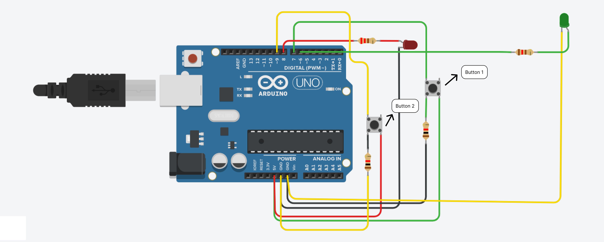

# LedWithAuthentication



> If the second button is pressed, the Red LED turn on. This means no pass is granted. (Turns on 3s.)

```c
if(digitalRead(BUTTONTWO_PIN)== HIGH) {
      	digitalWrite(LED_PIN, HIGH);
      	delay(3000);
    }
```

> And if the first button is pressed and then the second button is pressed, the Green LED will turn on. This means that the pass has been granted. 
>> The pass remains active for 10 secs.
```c
if (digitalRead(BUTTON_PIN) == HIGH) {
    for(int x=0;  x<=200; x++)
    {
      Serial.println(x);
      gate();
    delay(50);
    }
```

## Component List

| Name  | Qty | Component        |
| ----- | --- | ---------------- |
| U1    | 1   | Arduino Uno R3   |
| R1    | 1   | 220 ohm Resistor |
| D1    | 1   | Red LED          |
| S1-S2 | 2   | Button           |
| R3-R2 | 2   | 1k ohm Resistor  |
| D2    | 1   | Green LED        |
| R4    | 1   | 120 ohm Resistor |